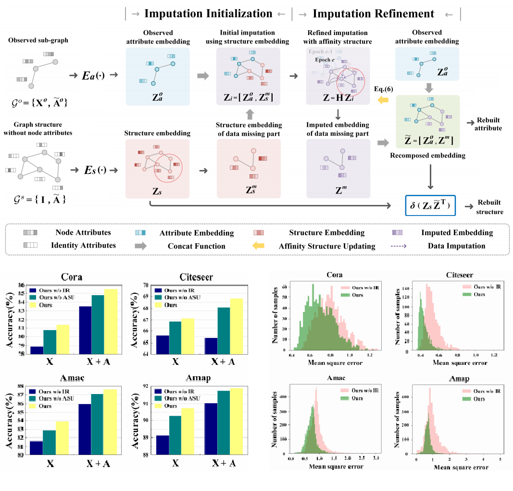

 <table style="text-align: left; height: 20px; width: 700px; margin-left: 16px;" border="0" cellpadding="0"
          cellspacing="2">
 <tbody> 
 <tr> 
 <td style="text-align: justify; width: 300px;">
   
     <b>2022</b>  
   
  
</td> 
 </tr> 
   <tr> 
 <td style="vertical-align: top; width: 300px;"> </td> 
 <td style="vertical-align: top; width: 400px;"> 
 
 
   
      Yue Liu, Wenxuan Tu, Sihang Zhou, Xinwang Liu, Linxuan Song, Xihong Yang, and En Zhu: <i>Deep Graph Clustering via Dual Correlation Reduction</i>. AAAI 2022. 
     [<a href="https://arxiv.org/pdf/2112.14772">paper</a>|<a href="https://github.com/yueliu1999/DCRN" >code</a>] 
   
  
 
 
<b>  </b>
 
 
  
 
We propose a self-supervised deep graph clustering method termed DCRN to address the representation collapse issue by reducing information correlation in a dual manner. Specifically, the cross-view sample correlation matrix and cross-view feature correlation matrix are forced to approximate two identity matrices, thus improving the discriminative capability of the resulting features.

 
 
 
 
   
 </td> 
 </tr> 
        <tr> 
 <td style="vertical-align: top; width: 300px;"> </td> 
 <td style="vertical-align: top; width: 400px;"> 
 
 
   
      Wenxuan Tu, Sihang Zhou, Xinwang Liu, Yue Liu, Zhiping Cai, En Zhu, Changwang Zhang, and Jieren Cheng: <i>Initializing Then Refining: A Simple Graph Attribute Imputation Network</i>. IJCAI 2022. 
     [paper|code] 
   
  
 
 
<b>  </b>
 
 
  
 
 We propose a graph-oriented imputation framework called initializing then refining (ITR), where we first employ the structure information for initial imputation, and then leverage observed attribute and structure information to adaptively refine the imputed latent variables.

 
 
 
 
   
 </td> 
 </tr> 
</tbody> 
</table>

[back](./)

